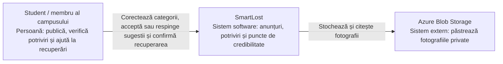
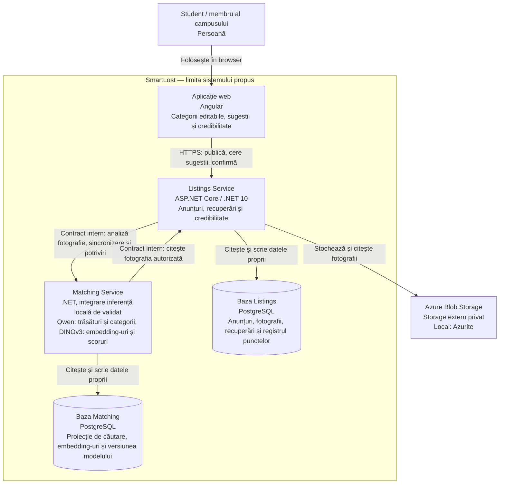
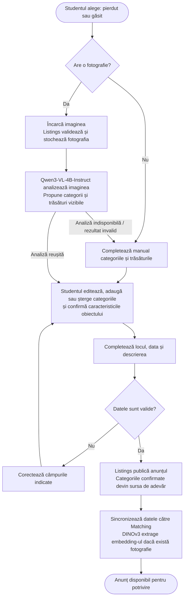
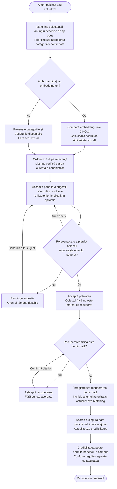

# SmartLost — obiecte pierdute și găsite într-un campus

## Descrierea proiectului

SmartLost este o aplicație web pentru un campus universitar, care ajută studenții să
recupereze obiecte pierdute prin asocierea anunțurilor de obiecte pierdute cu cele de
obiecte găsite. Este un proiect educațional, realizat pentru materia ASET.

Utilizatorul alege tipul «pierdut» sau «găsit» și încarcă fotografia obiectului.
Aplicația analizează imaginea folosind **Qwen3-VL-4B-Instruct** pentru extragerea
trăsăturilor și sugerarea uneia sau mai multor categorii. Studentul poate edita, adăuga sau elimina
categoriile asociate anunțului înainte de publicare și completează culoarea, locul
și data. Același flux de publicare se aplică ambelor tipuri de anunț.

Aplicația selectează mai întâi anunțurile cu categorii apropiate, apoi compară
reprezentările vizuale extrase cu **DINOv3 ViT-L/16** și generează un scor de similaritate.
Până la trei sugestii
relevante sunt aduse la cunoștința utilizatorilor în aplicație. Persoana care a pierdut
obiectul poate accepta sau respinge fiecare sugestie; acceptarea nu înseamnă încă
recuperarea fizică. După recuperarea confirmată, anunțul este închis, iar persoana
care a ajutat primește puncte de credibilitate. Acestea vor permite accesul la beneficii
în campus, după stabilirea regulilor și acordurilor cu facultatea.

De exemplu, un student pierde un ghiozdan albastru în bibliotecă și publică un anunț.
Un alt student publică un ghiozdan găsit în aceeași zonă. SmartLost poate sugera
asocierea pe baza categoriei, culorii, datei, locului și asemănării fotografiilor.
Confirmarea identității obiectului și recuperarea rămân în responsabilitatea oamenilor.

**Stadiu actual:** repository-ul conține AuthService (register/login, JWT, EF Core și
configurație PostgreSQL/Docker), biblioteci comune pentru entități, rezultate și pipeline,
teste și CI. Listings, Matching, interfața, modelele vizuale și infrastructura cloud
descrise mai jos reprezintă arhitectura propusă; nu sunt implementate.
Detaliile operaționale sunt în [README](../README.md).

## Funcționalitățile MVP

1. Încărcarea fotografiei pentru un anunț de obiect pierdut sau găsit.
2. Analiza imaginii și sugerarea categoriilor, cu editare, adăugare și ștergere manuală.
3. Publicarea anunțului cu categoriile confirmate și caracteristicile completate.
4. Selectarea candidaților după categorii, apoi calcularea similarității vizuale și
   afișarea a cel mult trei sugestii relevante pentru utilizatorii implicați.
5. Acceptarea sau respingerea sugestiei de către persoana care a pierdut obiectul.
6. Confirmarea recuperării și închiderea anunțului.
7. Acordarea punctelor de credibilitate pentru ajutorul oferit la recuperări confirmate.

Chat-ul, notificările prin email/push și moderarea avansată nu fac parte din MVP.
Sugestiile sunt comunicate în interfața aplicației; canalul de notificare externă
nu este ales. Se folosesc cele două modele preantrenate; nu se antrenează un model
de la zero. Categoriile sugerate de Qwen sunt verificate și confirmate de student.
AuthService implementează autentificare locală cu username/email, parole hash-uite și JWT.
Regulile de acces pentru anunțuri trebuie implementate înainte de expunerea aplicației:
numai autorul autorizat poate modifica sau închide anunțul. Integrarea cu identitatea
campusului nu este implementată.

## Stack tehnologic și stocarea imaginilor

| Componentă | Alegere propusă | Rol |
| --- | --- | --- |
| Frontend | Angular | Fotografie, categorii editabile, sugestii, recuperare și credibilitate |
| Backend | .NET 10 / ASP.NET Core | AuthService existent; Listings și Matching propuse, cu date proprii |
| Similaritate vizuală | [`facebook/dinov3-vitl16-pretrain-lvd1689m`](https://huggingface.co/facebook/dinov3-vitl16-pretrain-lvd1689m) | Embedding-uri pentru compararea fotografiilor |
| Trăsături și categorii | [`Qwen/Qwen3-VL-4B-Instruct`](https://huggingface.co/Qwen/Qwen3-VL-4B-Instruct) | Analiza imaginii și propuneri editabile de categorii și trăsături |
| Inferență locală | ONNX Runtime ca direcție inițială | Exportul și execuția ambelor modele trebuie validate; runtime-ul Qwen nu este încă stabilit |
| Date structurate | PostgreSQL | Anunțuri, metadate și datele de căutare deținute separat de servicii |
| Fotografii | Azure Blob Storage | Stocarea fișierelor într-un container privat |
| Emulare storage local | Azurite | Dezvoltare și teste locale pentru operațiile Blob |
| Containere | Docker | Împachetarea și rularea serviciilor |
| Găzduire ulterioară | Azure / Azure Kubernetes Service (AKS) | Orchestrarea și scalarea serviciilor |
| Infrastructure as Code | Terraform | Definirea infrastructurii Azure |
| CI/CD | GitHub Actions | CI existent; CD se va activa după configurarea infrastructurii și aprobărilor |

**Recomandarea pentru fotografii este Azure Blob Storage.** Se aliniază cu găzduirea
planificată în Azure și are un SDK oficial pentru .NET. Azurite permite dezvoltarea
locală fără folosirea unui cont cloud pentru operațiile de bază. Comportamentul de
autorizare din Azure trebuie verificat separat în cloud.

Firebase Storage este o alternativă validă, dar ar adăuga administrarea Google Cloud
la stack-ul Azure. Documentația Firebase cere planul Blaze pentru Cloud Storage,
chiar dacă sunt disponibile cote fără cost. Alegerea Blob Storage este bazată pe
integrare și simplitate operațională; nu presupune că este întotdeauna mai ieftin.
Costurile depind de regiune, capacitate, operații și trafic.

Pentru MVP, fotografia va fi încărcată prin Listings Service, care verifică dimensiunea,
tipul real și decodarea imaginii înainte de stocare. PostgreSQL va păstra identificatorul
blobului și metadatele, nu fișierul și nici URL-uri temporare de acces. Matching Service
va primi fotografia printr-un contract intern autorizat cu Listings Service.

Ulterior, upload-ul direct în Blob Storage poate folosi un SAS cu durată scurtă și
permisiuni limitate, emis după autorizarea utilizatorului. În AKS, accesul serviciilor
la storage poate folosi Microsoft Entra Workload ID. Aceste mecanisme nu sunt configurate.

Surse: [SDK Blob pentru .NET](https://learn.microsoft.com/en-us/azure/storage/blobs/storage-blob-dotnet-get-started),
[Azurite](https://learn.microsoft.com/en-us/azure/storage/common/storage-use-azurite),
[autorizare Blob și user delegation SAS](https://learn.microsoft.com/en-us/azure/storage/blobs/authorize-access-azure-active-directory),
[Workload ID în AKS](https://learn.microsoft.com/en-us/azure/aks/workload-identity-overview),
[cerințe Firebase Storage](https://firebase.google.com/docs/storage/faqs-storage-changes-announced-sept-2024).

### Rolurile modelelor și integrarea locală

**Qwen3-VL-4B-Instruct** primește fotografia și instrucțiuni de extragere a trăsăturilor
vizibile: tipul obiectului, categorii candidate, culoare și semne distinctive, când
pot fi observate. Răspunsul va fi cerut într-un format structurat și validat de aplicație.
Studentul confirmă sau corectează propunerile; modelul nu poate deduce în mod sigur
proprietarul, locul sau data pierderii/găsirii, care se introduc manual.

**DINOv3 ViT-L/16** extrage reprezentările numerice pentru similaritatea fotografiilor.
Nu este componenta care generează categoriile în acest proiect. Model card-ul îl
prezintă drept backbone vizual și include utilizarea pentru căutarea imaginilor.

Model card-urile prezintă exemple cu Transformers/PyTorch, iar cel Qwen include
opțiuni de serving precum vLLM și SGLang. Aceste exemple nu confirmă execuția ambelor
modele prin ONNX Runtime în .NET. Exportul, preprocesarea, generarea Qwen, memoria și
latența trebuie verificate într-un prototip. Backend-ul rămâne .NET; dacă integrarea
directă nu este fezabilă, se poate evalua un proces local de inferență accesat prin
contract intern, fără a considera această variantă deja decisă sau implementată.

Trebuie respectate condițiile de acces și licența DINOv3; model card-ul Qwen indică
licența Apache-2.0. Referințe: [DINOv3 model card](https://huggingface.co/facebook/dinov3-vitl16-pretrain-lvd1689m)
și [Qwen3-VL model card](https://huggingface.co/Qwen/Qwen3-VL-4B-Instruct).

## Arhitectură C4 propusă

Diagramele folosesc notația conceptuală C4, reprezentată cu Mermaid `flowchart`.
Nivelul 1 prezintă contextul sistemului; nivelul 2 prezintă aplicațiile și depozitele
de date. În C4, un «container» este o unitate de execuție sau stocare și nu înseamnă
neapărat un container Docker. Săgețile indică utilizarea unei componente sau accesul
la date, nu toate mesajele de răspuns.

### Nivelul 1 — contextul sistemului

### Nivelul 2 — containerele sistemului

Listings Service deține anunțurile, categoriile confirmate de student, starea recuperării,
metadatele fotografiilor și registrul punctelor de credibilitate. Pentru MVP, credibilitatea
este un modul al acestui serviciu, fără un al treilea microserviciu.
Matching Service coordonează analiza Qwen, deține reprezentările DINOv3 și o proiecție
a caracteristicilor necesare căutării. Modelele sunt componente de inferență locale;
diagrama nu fixează runtime-ul lor înainte de validarea tehnică.

Serviciile nu accesează direct baza de date a celuilalt. Referințele între ele sunt
identificatori de anunț, fără foreign keys între bazele serviciilor. Local, o singură
instanță PostgreSQL poate găzdui două baze cu utilizatori și permisiuni separate.

Contractele interne trebuie să permită sincronizarea la publicare, modificare și
închidere, cu operații idempotente și reîncercări persistente. Dacă Matching este
indisponibil, anunțul poate rămâne publicat, iar sugestiile sunt marcate ca în curs
de procesare. Mecanismul concret de sincronizare rămâne de implementat; nu există
în prezent broker de mesaje sau outbox.

La confirmarea recuperării, Listings închide anunțul autorului. Un anunț al altui
utilizator nu este închis automat fără o regulă explicită de autorizare. Listings
verifică starea curentă a candidaților înainte de afișare, pentru a exclude anunțurile
închise chiar dacă proiecția Matching nu a fost încă actualizată.

## Fluxul de utilizare propus

### Publicarea unui obiect pierdut sau găsit

Același flux se aplică ambelor tipuri de anunț. Fotografia este intrarea principală
pentru analiza automată. Ca variantă de rezervă, dacă studentul nu are o fotografie
sau analiza eșuează, poate completa manual categoriile și trăsăturile; în acest caz
nu se generează un scor vizual pentru acel anunț.

### Potrivirea, recuperarea și credibilitatea

## Cum funcționează potrivirea

Potrivirea are două etape. Mai întâi se compară categoriile confirmate de utilizatori
pentru a selecta anunțurile apropiate semantic, de tip opus și încă deschise. Apoi
se compară embedding-urile DINOv3 ale fotografiilor candidaților, pentru a calcula
similaritatea vizuală. Embedding-urile se calculează o dată pentru fiecare fotografie
și versiune de model și se reutilizează la căutare.

Ca metodă inițială propusă, se poate folosi similaritatea cosinus între embedding-uri
normalizate. Metoda, preprocesarea și pragul de relevanță trebuie validate pe obiecte
fotografiate din unghiuri și în condiții de lumină diferite. Nu este încă implementată.

Qwen propune categoriile și trăsăturile, dar Matching folosește valorile finale corectate
de student. Aplicația trebuie să normalizeze sinonimele, de exemplu «ghiozdan» și
«rucsac», pentru a evita pierderea candidaților din cauza formulării. Editarea privește
categoriile asociate anunțului; administrarea unui catalog global rămâne de definit.

Scorul vizual și scorul de relevanță al sugestiei sunt distincte. Relevanța poate
combina apropierea categoriilor, similaritatea vizuală, culoarea, zona și data.
Ponderile se vor calibra pe exemple. Fără fotografie sau la eșecul inferenței se
folosesc caracteristicile disponibile, fără inventarea unui scor vizual.

Relația temporală se interpretează în funcție de tipul anunțului: data găsirii nu
ar trebui să preceadă pierderea, cu o toleranță care trebuie definită pentru date
introduse aproximativ. Rezultatele sunt limitate la candidați relevanți: pot exista
zero, una, două sau trei sugestii.

Motivele afișate trebuie să provină din calculul efectiv: «aceeași categorie»,
«culoare asemănătoare», «aceeași zonă», «date apropiate» sau «asemănare vizuală».
Scorul este o măsură de relevanță, nu o probabilitate validată că obiectele sunt identice.

Respingerea unei sugestii se înregistrează pentru perechea de anunțuri și nu închide
anunțul. Acceptarea înregistrează o posibilă asociere; numai confirmarea recuperării
declanșează închiderea și acordarea punctelor.

## Puncte de credibilitate și beneficii în campus

Studentul care contribuie la recuperarea unui obiect primește puncte de credibilitate
după confirmarea recuperării de către persoana care l-a pierdut. Credibilitatea
reflectă ajutorul oferit la recuperări reale, nu numărul de anunțuri publicate sau
numărul de potriviri acceptate. Numărul persoanelor ajutate trebuie urmărit separat
de numărul recuperărilor, pentru ca ajutorul repetat aceleiași persoane să fie transparent.

Pentru MVP, Listings păstrează un registru de acordări legat de recuperare, beneficiar
și persoana ajutată. Aceeași recuperare nu poate acorda puncte de mai multe ori la
reîncercări sau confirmări repetate. Nu se acordă puncte pentru ajutor către propriul
cont. Regulile de validare a recuperărilor și gestionarea abuzurilor trebuie definite
înainte ca punctele să producă beneficii reale.

Punctajul per recuperare, pragurile de credibilitate și beneficiile concrete nu sunt
încă stabilite. Beneficiile vor depinde de acordurile cu facultatea; acest document
nu presupune că există deja reduceri, privilegii sau integrări cu sistemele campusului.

## Infrastructura existentă și ce mai trebuie construit

| Zonă | Implementat/configurat în repository | De construit |
| --- | --- | --- |
| .NET | SDK 10.0.401, net10.0, C# 14, AuthService și biblioteci comune Core/Application/AspNetCore | Listings, Matching și modulul de credibilitate |
| Modele | Fără modele descărcate sau integrare de inferență în repository | Qwen pentru trăsături/categorii, DINOv3 pentru similaritate și validarea runtime-urilor locale |
| CI | Toate branch-urile, fiecare commit introdus, candidatul de merge și gate-ul `CI / Required` | Verificări Angular și verificări dedicate infrastructurii când aceasta apare |
| Testare | Teste pentru AuthService și building blocks; Coverlet, praguri strict peste 80% și respingerea suitelor goale/nepromovate | Integrare pe PostgreSQL real și testele viitoarelor servicii |
| Securitate | Gitleaks, Trivy, actionlint, audit NuGet, Dependabot | Validarea noilor dependențe și configurații prin aceleași gate-uri |
| Docker | Dockerfile AuthService, Compose cu API/PostgreSQL, exemple `appsettings`, `.dockerignore`, pași CI pentru scanare imagini și SBOM | Containere pentru viitoarele servicii |
| CD | Plan și template inactiv în `docs/examples/deploy.yml` | Registry, OIDC, infrastructură, aprobări, deploy, smoke tests și rollback |
| Cloud/date | PostgreSQL configurat local pentru AuthService; fără resurse cloud implementate | Bazele Listings/Matching, Blob Storage, Terraform și AKS |

Build-ul, formatarea și unit tests sunt configurate pentru Linux, Windows și macOS;
integration tests sunt configurate pentru Linux. Pașii aplicației sunt omiși cât timp
nu există proiecte. Existența workflow-urilor nu dovedește rulări CI reușite.

Ruleset-ul pentru `main` există ca fișier; activarea pe GitHub nu a fost verificată
în această analiză. CD rămâne inactiv până la configurarea infrastructurii reale și
a aprobărilor. Orchestrarea CI/CD rămâne în YAML GitHub Actions, cu pași nativi inline.

Ordinea recomandată este: servicii și date locale → fluxul MVP complet → validarea
potrivirilor și teste → containere → infrastructură Azure → activarea controlată a CD.
Serviciile pot fi pregătite pentru replicare independentă; scalarea efectivă depinde
de configurarea AKS, resurse, sincronizare și măsurători de încărcare.

## Documente existente și verificare

- [README și starea operațională a repository-ului](../README.md)
- [CI și regulile de acoperire](../.github/README.md)
- [Standarde C#](CODING_STANDARDS.md)
- [Configurarea protecțiilor GitHub](GITHUB_SETUP.md)
- [Planul de activare a deployment-ului](DEPLOYMENT.md)

Descrierea stării existente a fost verificată prin inspectarea structurii, soluției,
configurației de build, workflow-urilor și documentației. Această schimbare adaugă
documentație; nu implementează servicii și nu confirmă build-uri, teste sau deployment-uri.
