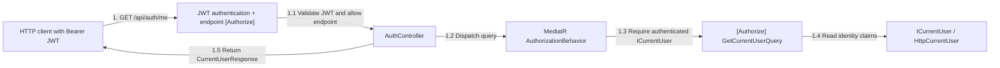
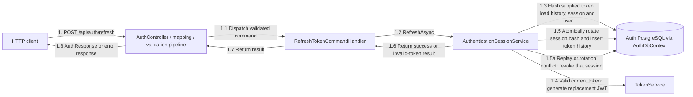

# Auth communication diagrams

These diagrams describe the current implementation. Numbered arrows show runtime
interactions, not compile-time project dependencies. Each numbered flow is independent.
Solid arrows are implemented; dashed arrows describe the required receiver contract,
whose implementation is absent. Auth owns every database table shown here.

## Registration and login

```mermaid
flowchart LR
    Client["HTTP client"]
    API["AuthController / AutoMapper"]
    Pipeline["MediatR: Profiling / ExceptionToResult / Authorization / Validation / Caching / Transaction"]
    Handler["RegisterUserCommandHandler or LoginUserCommandHandler"]
    Password["PasswordService"]
    Repository["UserAccountRepository"]
    Session["AuthenticationSessionService"]
    Tokens["TokenService"]
    Context["AuthDbContext + outbox mapper/writer"]
    DB[("Auth PostgreSQL: Users, RefreshSessions, RefreshTokens, OutboxMessages")]

    Client -->|"1. POST /api/auth/register or /api/auth/login"| API
    API -->|"1.1 Map request and dispatch command"| Pipeline
    Pipeline -->|"1.2 After validation: begin AuthUnitOfWork transaction; invoke handler"| Handler
    Handler -->|"1.3 Check uniqueness or load user"| Repository
    Repository -->|"1.3.1 Query Users through AuthDbContext"| DB
    Handler -->|"1.4 Hash password or verify credentials"| Password
    Handler -->|"1.5 Create session after successful checks"| Session
    Session -->|"1.5.1 Generate JWT"| Tokens
    Session -->|"1.5.2 Stage session and token history without saving"| Context
    Pipeline -->|"1.5.3 Success: SaveChanges via repository and commit; failure: rollback"| Context
    Context -->|"1.5.4 Commit tracked rows and selected outbox events together; clear events after commit"| DB
    Handler -->|"1.6 Return result through pipeline"| API
    API -->|"1.7 AuthResponse or error response"| Client
```

Registration also stages a new user through the repository. Its user, first session,
token history and `auth.user.created` message commit together. Login creates a session
but exports no session event. Failures short-circuit the successful path above.
The JWT is generated before saving but returned only after the pipeline commits.
RegisterUserCommand and LoginUserCommand implement ITransactionalCommand. Failure Results,
exceptions or cancellation roll back the transaction; rollback retains the entity events
and detaches discarded tracked work. RefreshTokenCommand is unmarked: its replay revocation
must persist even when the command returns an invalid-token failure.

## Current user identity

```mermaid
flowchart LR
    Client["HTTP client with Bearer JWT"]
    Middleware["JWT authentication + endpoint [Authorize]"]
    API["AuthController"]
    Pipeline["MediatR AuthorizationBehavior"]
    Query["[Authorize] GetCurrentUserQuery"]
    User["ICurrentUser / HttpCurrentUser"]

    Client -->|"1. GET /api/auth/me"| Middleware
    Middleware -->|"1.1 Validate JWT and allow endpoint"| API
    API -->|"1.2 Dispatch query"| Pipeline
    Pipeline -->|"1.3 Require authenticated ICurrentUser"| Query
    Query -->|"1.4 Read identity claims"| User
    API -->|"1.5 Return CurrentUserResponse"| Client
```

The HTTP attribute rejects unauthenticated requests before the action executes. The Application
attribute separately protects direct MediatR dispatches; register, login and refresh requests
have no Application authorization attribute and remain public.

## Refresh and replay handling

```mermaid
flowchart LR
    Client["HTTP client"]
    API["AuthController / mapping / validation pipeline"]
    Handler["RefreshTokenCommandHandler"]
    Session["AuthenticationSessionService"]
    Tokens["TokenService"]
    DB[("Auth PostgreSQL via AuthDbContext")]

    Client -->|"1. POST /api/auth/refresh"| API
    API -->|"1.1 Dispatch validated command"| Handler
    Handler -->|"1.2 RefreshAsync"| Session
    Session -->|"1.3 Hash supplied token; load history, session and user"| DB
    Session -->|"1.4 Valid current token: generate replacement JWT"| Tokens
    Session -->|"1.5 Atomically rotate session hash and insert token history"| DB
    Session -->|"1.5a Replay or rotation conflict: revoke that session"| DB
    Session -->|"1.6 Return success or invalid-token result"| Handler
    Handler -->|"1.7 Return result"| API
    API -->|"1.8 AuthResponse or error response"| Client
```

Steps 1.4–1.5 are the valid-token path; 1.5a is the alternative replay/conflict path.
Unknown tokens and expired/revoked sessions return an invalid-token result without
rotation. Rotation preserves the session's original expiry. Refresh/session events
are local domain events and are not exported to the outbox.

## Durable profile notification and delivery

```mermaid
flowchart LR
    Operation["Auth operation: create user or change identity"]
    Context["AuthDbContext"]
    Mapper["AuthOutboxEventMapper / OutboxWriter"]
    DB[("Auth PostgreSQL: Users + OutboxMessages")]
    Worker["Separate finite AuthOutboxJob / OutboxProcessor"]
    Publisher["AuthOutboxHttpPublisher"]
    Receiver["Configured HTTP receiver: not implemented in this repository"]

    Operation -->|"1. Save tracked user changes"| Context
    Context -->|"1.1 Map selected domain events and stage messages"| Mapper
    Mapper -->|"1.2 Add OutboxMessage to the same context"| Context
    Context -->|"1.3 Commit user change and outbox row atomically"| DB
    Worker -->|"2. Read pending rows and claim with expiring lease"| DB
    DB -->|"2.1 Claimed message envelope"| Worker
    Worker -->|"2.2 PublishAsync"| Publisher
    Publisher -.->|"2.3 POST envelope with service key and Idempotency-Key"| Receiver
    Receiver -.->|"2.4 Contract: acknowledge with 2xx after durable processing"| Publisher
    Publisher -->|"2.5 Success or delivery failure"| Worker
    Worker -->|"2.6 Set ProcessedOn, or retry / dead-letter state"| DB
```

Flow 2 runs separately from flow 1. The API does not wait for receiver delivery.
Only `auth.user.created` and `auth.user.identity_changed` are exported, containing
`userId`, `userName` and `identityVersion`. Identity mutation exists in the domain;
there is no public profile-update endpoint currently.

Delivery can happen more than once. Receivers must durably deduplicate message IDs
and ignore older/equal identity versions before acknowledging. Leases limit competing
workers; failures use bounded retries and eventually dead-letter state. The worker
does not poll continuously: it runs a bounded number of batches and exits, including
when a batch acknowledges zero messages. Later retries require another invocation.
No cloud schedule or receiver is configured by the repository examples.

## Source references

- [Controller](SmartLost.AuthService.Api/Controllers/AuthController.cs) and [API composition](SmartLost.AuthService.Api/Program.cs)
- [Register](SmartLost.AuthService.Application/Commands/Register/RegisterUserCommandHandler.cs), [login](SmartLost.AuthService.Application/Commands/Login/LoginUserCommandHandler.cs) and [refresh](SmartLost.AuthService.Application/Commands/Refresh/RefreshTokenCommandHandler.cs) handlers
- [Current-user query](SmartLost.AuthService.Application/Queries/GetCurrentUser/GetCurrentUserQuery.cs), [handler](SmartLost.AuthService.Application/Queries/GetCurrentUser/GetCurrentUserQueryHandler.cs) and [shared authorization behavior](../../BuildingBlocks/SmartLost.BuildingBlocks.Application/Behaviors/AuthorizationBehavior.cs)
- [Session service](SmartLost.AuthService.Infrastructure/Authentication/AuthenticationSessionService.cs) and [AuthDbContext](SmartLost.AuthService.Infrastructure/Persistence/AuthDbContext.cs)
- [Event mapper](SmartLost.AuthService.Infrastructure/Outbox/AuthOutboxEventMapper.cs), [HTTP publisher](SmartLost.AuthService.Infrastructure/Outbox/AuthOutboxHttpPublisher.cs) and [shared processor](../../BuildingBlocks/SmartLost.BuildingBlocks.Infrastructure/Outbox/OutboxProcessor.cs)
- [Worker operation and receiver contract](SmartLost.AuthService.Worker/README.md)

## Review notes

- 2026-11-09: Root Compose now groups all three APIs and their databases. Listings containers
  were moved from the standalone project while reusing the existing volume as external; fresh
  setups use a managed volume. Only container grouping, network placement and configuration
  paths change. HTTP routes, database ownership, CQRS/worker flows and outgoing service calls
  are unchanged.

- 2026-11-09: enabled TransactionBehavior for register/login and added scoped AuthUnitOfWork.
  Flow 1 now begins a transaction after validation, stages session/token changes, and saves
  user/session/token/Outbox rows once before the final commit. Events clear after commit;
  failures roll back and discard tracked state. Refresh, current-user reads, worker delivery
  and cross-service boundaries are unchanged. SQLite and PostgreSQL tests cover the change.

- 2026-11-09: moved GetCurrentUserQuery and its authorization attribute into its own
  file, separate from the handler. Types, namespaces, authorization checks and MediatR
  dispatch are unchanged; all numbered HTTP, persistence and worker arrows still apply.

- 2026-11-08: Enabled shared profiling and the attribute-driven cache wrapper alongside
  authorization. No Auth request carries a cache attribute, so identity/token responses remain
  per-request. Registration, JWT, database and worker/Outbox arrows are unchanged; profiling
  adds operation metadata logging around MediatR without request payloads.

- 2026-11-08: integrated main's authorization/profiling with Listings caching in the shared
  registration. Auth still enables only authorization; registration/login/refresh remain
  public and /me retains both HTTP and Application protection. Its API, persistence and
  Outbox arrows are unchanged. Existing patched Auth images are retained.

- 2026-11-08: reviewed the shared Listings contracts project and CI inventory/coverage
  handling. Auth does not reference it; API, database, worker and Outbox arrows remain
  unchanged. A contract-only library introduces no runtime communication.

- 2026-11-08: reviewed the shared cache expiration fix: stale lookups no longer remove
  a concurrent refresh by key. Auth does not enable query caching, so its numbered API,
  persistence and Outbox arrows and failure/retry paths remain unchanged.

- 2026-11-06: API/worker Dockerfiles now patch and version-check the inherited Ubuntu
  APT packages for USN-8996-1 using HTTPS sources before non-root execution. This is a
  build-time OS package update; numbered HTTP, persistence, Outbox and receiver arrows,
  runtime settings and failure/retry behavior are unchanged.

- 2026-11-04: reviewed shared query-cache additions. Auth still calls AddBuildingBlocksApplication without useCaching and does not register IQueryCache. Its credential/session commands and numbered runtime/database/Outbox arrows are unchanged.

- Initial diagrams checked against the API, handlers, session service, context and
  outbox implementation. Update affected flows with service changes; if communication
  is unchanged, record what changed and why these diagrams still apply here.
- 2026-10-22: Added a separate NMF structural-model project for Auth entities. It has no
  runtime references from the API, application, domain, infrastructure or worker layers, and
  does not add persistence, messages, workers or outgoing calls; all numbered flows remain unchanged.
- 2026-11-05: root `docker-compose.yml` gained the separate `matching-db` (host port 5433,
  volume `matching-db-data`) and `matching-service` (host port 8081) services. Auth services,
  ports, settings, database and flows are unchanged; Auth has no connection to Matching.
- 2026-11-05: the API and worker Dockerfiles now run `apt-get upgrade` in the runtime stage,
  so the image includes Ubuntu security fixes newer than `aspnet:10.0` (CVE-2026-109518 in
  `apt` failed the CI Trivy image gate). This is a container build change only; Auth code,
  settings, ports and all flows are unchanged.

- 2026-11-08: reviewed shared opt-in profiling extraction into BuildingBlocks. Auth does not enable profiling, so JWT, validation, persistence, Outbox delivery and all numbered communication arrows are unchanged.
- 2026-11-08: removed the previous cross-cutting prototype and its persistence/inspection route.
  Added the opt-in attribute-based AuthorizationBehavior and `/api/auth/me`. Endpoint and
  Application attributes admit the same bearer-authenticated caller; this adds no persistence,
  outgoing call, worker or message interaction.
